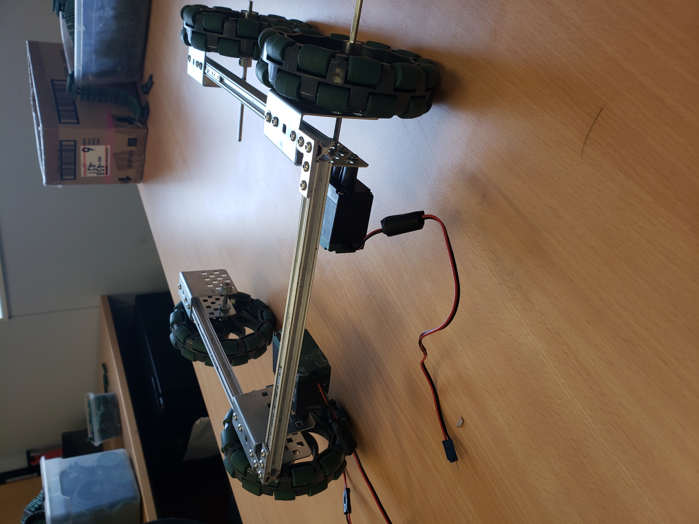

# Saturday, February 23, 2019 Team Meeting

Today, we began constructing the robot.

Members present: Nathan, Hadja, Le, Mitchell, Andrew

| Team Roles       | Members          | What we accomplished                                  |
|------------------|------------------|-------------------------------------------------------|
| Bot Construction | Hadja, Nathan    | Constructed drivetrain and its motors                 |
| Electronics      | Andrew, Mitchell | Connected battery to fuseblock and tested electronics |
| Programming      | Le               | Set up java environment                               |

| What we wish to accomplish next |
|---------------------------------|
|Mount arduino and battery to robot|
|Wire electronics                 |
|Begin programming robot          |

